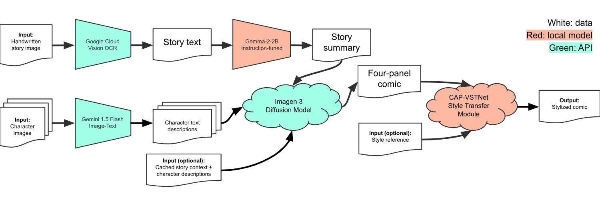

# AI-Powered Story to Comic Generator




Writing stories by hand has always been an accessible way for people of all ages to express themselves and their ideas. But making these ideas visually come to life can be challenging: drawing is a time-consuming and difficult task for many, and personalizing these cartoons is impossible using just online images. Thus, our project aims to harness foundational AI models to recognize and synthesize material from user-provided stories and character images, from which we generate original four-panel comics. We compose the original AI storybook pipeline with a style transfer network to give users greater control over the final appearance. Furthermore, our project uses prompt engineering to maintain plot and character cohesion between generated stories as an incentive for users to keep coming back to our tool.

## Setup
### Python
Create a Python environment (version 3.11.10).
Run in root directory:
```
pip install -r requirements.txt
```

### Google Cloud 
Follow the following documentation to set up a Google Cloud project with Cloud Vision and Vertex AI enabled:
* [Cloud Vision](https://cloud.google.com/vision/docs/setup)
* [Vertex AI](https://cloud.google.com/vertex-ai/docs/start/cloud-environment)

Modify the `PROJECT_ID` variable in [constants.py](constants.py) to your project's ID.

Create a [service account](https://cloud.google.com/iam/docs/service-accounts-create) in your project with the following roles:
* Cloud Vision AI Service Agent
* Vertex AI Service Agent

Download the service account key as a JSON and save to `auth/cis-5810-final-project.json`.

### Hugging Face

Sign up for a [Hugging Face](https://huggingface.co/login) account and [create an authorization token](https://huggingface.co/docs/hub/en/security-tokens).
Set `HF_TOKEN` variable in [constants.py](constants.py) to be your authorization token.
Finally, accept the terms to access the [Gemma 2 model](https://huggingface.co/google/gemma-2-2b) on Hugging Face.

## Interface
To deploy the Gradio interface, run in root directory:
```
python interface.py
```

## Examples
To generate example comics, add a `Config` class to `example_configs.py`, edit `RUN_CONFIGS` in `example.py`, and run in root directory:
```
python example.py
```

To apply the CAP-VSTNet style transfer network on the generated comics, run:
```
python stylization.py
    --content <path to source image>
    --style <path to style reference image>
```

## Google Colab
As an alternative to running the pipeline locally, we provide a [Colab Notebook](https://colab.research.google.com/drive/1Hy4dq6f8ijUneZoDJHxTeda40wqmx903?usp=sharing) for deploying the interface. The notebook should be run in a GPU environment (e.g. T4 runtime environment).